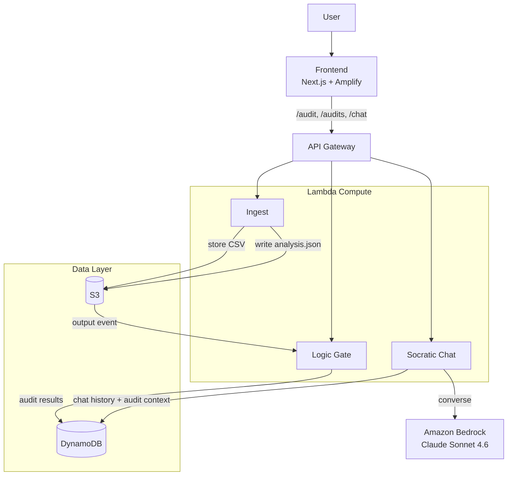

# Guardian - The Algorithmic Auditor

An AWS-native AI governance layer that audits AI outputs for proxy bias, calculates legal liability debt, and guides ethical decision-making through Socratic scaffolding.

## Documentation

- Detailed architecture: `docs/architecture.md`
- User guide: `docs/user-guide.md`

## Architecture

| Layer | Service | Purpose |
|-------|---------|---------|
| Frontend | Next.js on Amplify | CSV upload, audit dashboard, Socratic chat |
| API | API Gateway (REST) | Routes requests to Lambda functions |
| Ingest | AWS Lambda (Python) | Parses CSV, uploads to S3, runs bias analysis |
| Bias Engine | AWS Lambda (Python) | Statistical parity checks (Disparate Impact / 4/5ths) |
| Logic Gate | AWS Lambda (Python) | 4/5ths rule, Legal Liability Debt calculation, proxy detection |
| Socratic Tutor | AWS Lambda + Bedrock | Claude Sonnet 4.6 for guided fairness exploration |
| Storage | DynamoDB + S3 | Audit logs, chat history, CSV data |

### Architecture Diagram



## Project Structure

```
spark-challenge/
├── cdk/                  # AWS CDK infrastructure (TypeScript)
│   ├── bin/              # CDK app entry point
│   └── lib/              # Stack definitions
├── lambdas/              # Python Lambda functions
│   ├── shared/           # Shared models & DynamoDB helpers (Lambda layer)
│   ├── ingest/           # CSV ingestion + in-Lambda bias analysis
│   ├── logic_gate/       # Ethics Logic Gate (4/5ths rule)
│   └── socratic_chat/    # Bedrock-powered Socratic tutor
├── frontend/             # Next.js application
│   └── src/
│       ├── app/          # Pages (upload, audit detail, dashboard)
│       ├── components/   # UI components
│       └── lib/          # API client
└── scripts/              # Deployment helpers
```

## Prerequisites

- Node.js 18+
- Python 3.12
- AWS CLI configured with appropriate credentials
- AWS CDK CLI (`npm install -g aws-cdk`)
- For Amplify GitHub deployment: a GitHub PAT with repository/webhook permissions

## Setup

### 1. CDK Infrastructure

```bash
cd cdk
npm install
npx cdk bootstrap   # First time only
npx cdk deploy
```

After deployment, note the API Gateway URL from the stack outputs.

### 2. Frontend

```bash
cd frontend
npm install
cp .env.local.example .env.local
# Edit .env.local with your API Gateway URL
npm run dev
```

The frontend is configured for static export (`next.config.js` sets `output: "export"`).

### 3. One-shot AWS deployment (Backend + Amplify via GitHub)

Use the script below to:
- deploy backend first (CDK),
- create/update an Amplify app connected to GitHub,
- create/update a production branch,
- trigger a frontend release build.

```bash
./scripts/deploy-amplify.sh
```

The script prompts for:
- GitHub repository URL
- GitHub access token (hidden input)

After it runs, the script prints your Amplify app ID, release job ID, and console URL.

## Guardrails

### Ethics (Inclusion) — The 4/5ths Rule
If the selection rate of a protected group falls below 80% of the highest group's rate, the API call is blocked and the user is directed to the Fairness Workshop.

### Economics (Transparency) — Legal Liability Debt
Estimates potential class-action/EEOC/GDPR fine exposure:
```
liability = (1.0 - impact_ratio) * $1,000,000
```

### Education (Agency) — Socratic Scaffolding
When bias is detected, Bedrock (Claude Sonnet 4.6) guides users through understanding the bias via Socratic questioning rather than prescriptive fixes.

### Environment (Accountability) — Green-Audit Compute
All compute runs on serverless Lambda, spinning up only during audits to minimize carbon footprint.

## API Endpoints

- `POST /audit` - start an audit from CSV payload
- `GET /audit/{auditId}` - fetch a single audit result
- `GET /audits` - list historical audits
- `POST /chat` - send Socratic tutor message for an audit
