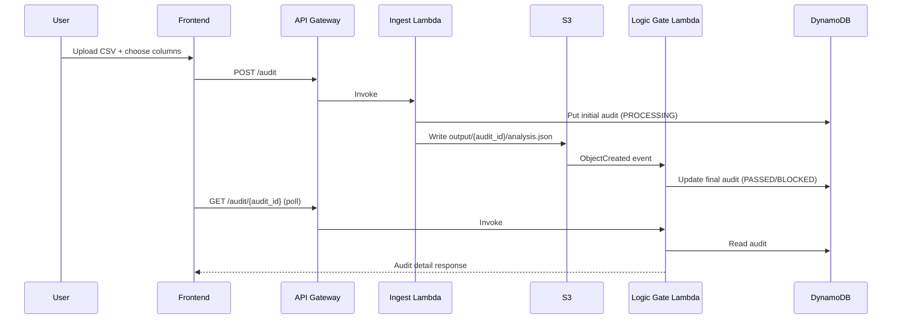
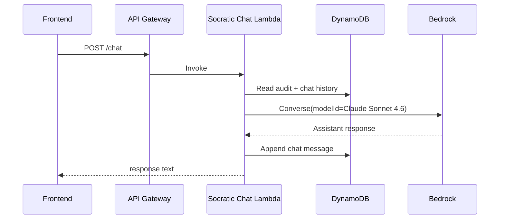

# Guardian Architecture (Detailed)

This document explains Guardian's runtime architecture, data flow, and major design decisions.

## 1) System Context

Guardian is a serverless governance layer for tabular decision datasets.

- Frontend: Next.js static site hosted on Amplify
- API: API Gateway (REST)
- Compute: Python Lambdas (`ingest`, `logic_gate`, `socratic_chat`)
- Storage: S3 + DynamoDB
- AI: Amazon Bedrock (Claude Sonnet 4.6 via inference profile)

```mermaid
flowchart TD
    U[User]
    FE[Amplify-hosted Next.js]
    API[API Gateway REST]

    U --> FE
    FE -->|POST /audit| API
    FE -->|GET /audit/{id}, GET /audits| API
    FE -->|POST /chat| API

    API --> ING[Ingest Lambda]
    API --> GATE[Logic Gate Lambda]
    API --> CHAT[Socratic Chat Lambda]

    ING -->|CSV + analysis JSON| S3[(S3)]
    S3 -->|ObjectCreated output/*/analysis.json| GATE
    GATE <--> DDB[(DynamoDB)]
    CHAT <--> DDB
    CHAT --> BR[Amazon Bedrock<br/>Claude Sonnet 4.6]
```

## 2) Component Responsibilities

### Frontend (`frontend/`)

- Uploads CSV
- Lets user choose:
  - protected attribute column
  - outcome column
- Polls audit status and renders:
  - impact ratio gauge
  - liability debt
  - proxy warnings
- Provides Socratic chat UI

### Ingest Lambda (`lambdas/ingest/handler.py`)

- Validates request payload
- Parses CSV and validates selected columns
- Runs in-Lambda bias analysis
- Writes `analysis.json` to S3 (`output/{audit_id}/analysis.json`)
- Persists initial audit record to DynamoDB

### Logic Gate Lambda (`lambdas/logic_gate/handler.py`)

Dual role:

1. Event-driven processor for S3 analysis output
2. HTTP handler for:
   - `GET /audit/{id}`
   - `GET /audits`

Core logic:

- Computes impact ratio from group selection rates
- Applies 4/5ths rule (`impact_ratio < 0.80` => BLOCKED)
- Calculates liability debt:
  - `liability = (1 - impact_ratio) * 1,000,000`
- Adds proxy feature warnings heuristically

### Socratic Chat Lambda (`lambdas/socratic_chat/handler.py`)

- Retrieves audit context and prior chat history from DynamoDB
- Calls Bedrock Converse API
- Enforces concise structured tutoring prompt
- Appends assistant response to chat history

## 3) Data Design

### S3

- `uploads/{audit_id}/data.csv`
- `output/{audit_id}/analysis.json`

### DynamoDB

Single-table pattern used for:

- audit records
- chat message history

Audit records include:

- audit id
- status
- impact ratio
- liability debt
- selected columns
- reason/action text
- proxy warnings
- timestamps

## 4) Core Runtime Flows

### A) Audit Execution Flow



### B) Socratic Chat Flow



## 5) Security and Access

- API CORS enabled for browser clients
- Lambda IAM policies scoped to required services:
  - S3 access for ingest/logic gate
  - DynamoDB read/write where needed
  - Bedrock invoke permissions for chat lambda
- No long-running compute; all functions are on-demand

## 6) Operational Characteristics

- Serverless, event-driven processing
- Static frontend deployment
- Build-time frontend API URL injection (`NEXT_PUBLIC_API_URL`)
- CloudWatch logs for each Lambda

## 7) Known Constraints

- Current `/audit` request sends base64 CSV in JSON body
- API Gateway payload limits apply; very large CSVs require direct S3 upload pattern
- Frontend currently enforces client-side file size guard

## 8) Future Enhancements

- Presigned S3 upload for large files
- True Bedrock streaming to browser (SSE/WebSocket)
- More robust proxy bias detection and feature importance overlays
- Fine-grained authN/authZ for multi-tenant use
